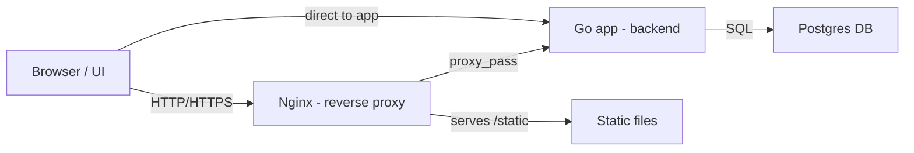
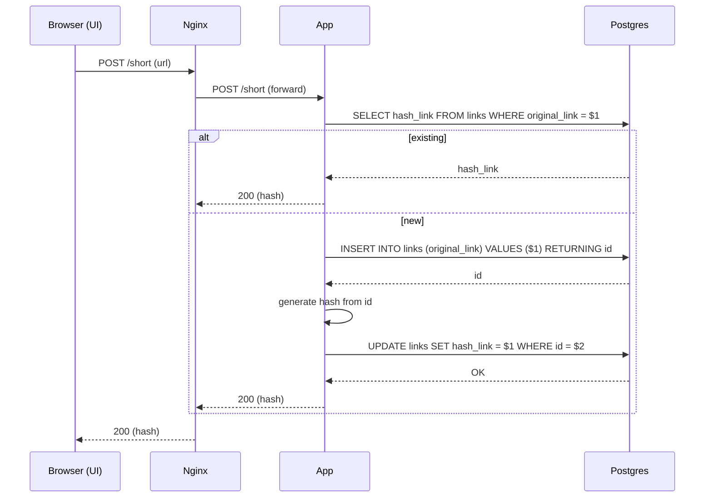
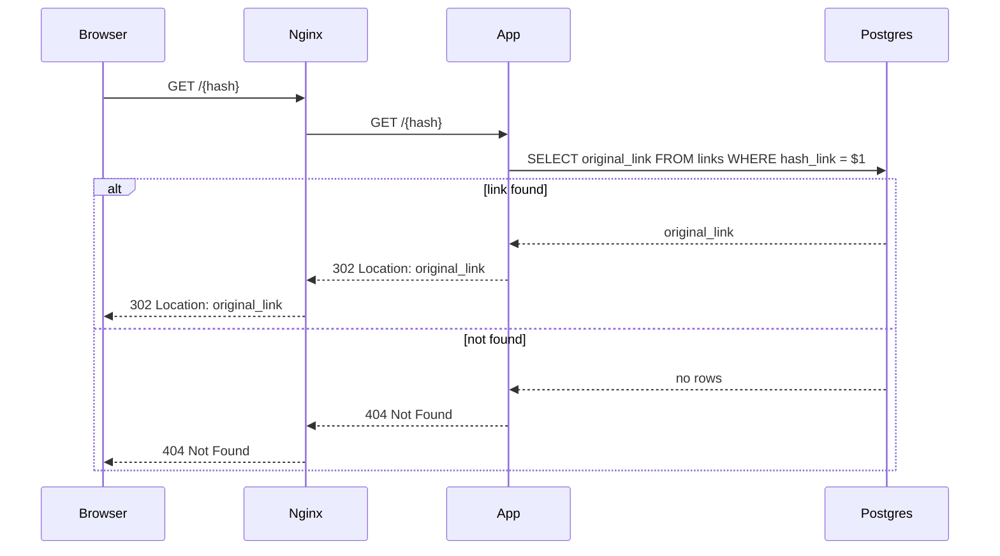

# Architecture

## Общая идея

Сервис хранит пары:

`оригинальная ссылка` → `короткий хэш`

Когда клиент отправляет post-запрос с URL:

1) проверка ссылка рабочая (HEAD-запрос)
2) сохраняем исходной ссылки в Postgres
3) генерирация хэша из `id` записи
4) возврат хэша

## Компоненты

### 1) Go-приложение (backend)

- HTTP-сервер на `:8080` или `:443`
- роутинг через `chi`
- бизнес-логика: создание короткой ссылки и редирект

Ключевые файлы:

- `main.go` — старт приложения
- `pkg/server/server.go` — роуты и запуск сервера
- `pkg/handlers/handlers.go` — обработчики запросов
- `pkg/hash/hash.go` — генерация хэша

### 2) Postgres (хранилище)

В базе одна таблица `links`.
Она создаётся автоматически при старте приложения.

Схема (упрощённо):

- `id` — авто-инкремент
- `original_link` — исходная ссылка (уникальная)
- `hash_link` — короткий хэш (уникальный)

### 3) Статика (UI)

В `static/web.html` лежит простая страница:

- поле ввода
- кнопка “Short”
- вывод результата и кнопка “копировать”

UI делает `fetch('/short', { method: 'POST', ... })` и получает в ответ просто хэш.
Полную ссылку UI собирает сам: `window.location.origin + '/' + hash`.

### 4) Nginx (опционально)

В Docker Compose есть Nginx:

- принимает входящий HTTP/HTTPS
- отдаёт `/static/` как файлы
- проксирует остальное на `app:8080`

Для локальной разработки можно добавить в секцию `app` в файле [docker-compose.yaml](docker-compose.yaml) параметр:

```yaml
ports:
	- "8080:8080"
```

и затем ходить напрямую на `http://localhost:8080`.

## Потоки запросов

### Сокращение ссылки

`Browser/UI → POST /short → Postgres → ответ (hash)`

Что происходит внутри:

1) handler читает `url` из `application/x-www-form-urlencoded`
2) делает HEAD-запрос к `url` (проверка доступности)
3) если ссылка уже есть в базе — сразу возвращает существующий `hash_link`
4) иначе вставляет строку в `links`, получает `id`
5) считает `hash` из `id` (base62)
6) обновляет `hash_link` в базе
7) возвращает хэш в ответе

### Диаграммы (Mermaid)

Ниже — визуальные диаграммы, которые поясняют архитектуру и потоки.

**Компонентная схема**



**Sequence: Shorten flow**



**Sequence: Redirect flow**



### Переход по короткой ссылке

`Browser → GET /{hash} → Postgres → 302 Location: original_link`

## Конфигурация

Приложение читает `.env` через `godotenv`.
Главные параметры — доступ к Postgres: `DB_HOST`, `DB_PORT`, `DB_USER`, `DB_PASSWORD`, `DB_NAME`.

В Docker Compose `DB_HOST=postgres`, потому что это имя сервиса в одной сети Docker.
